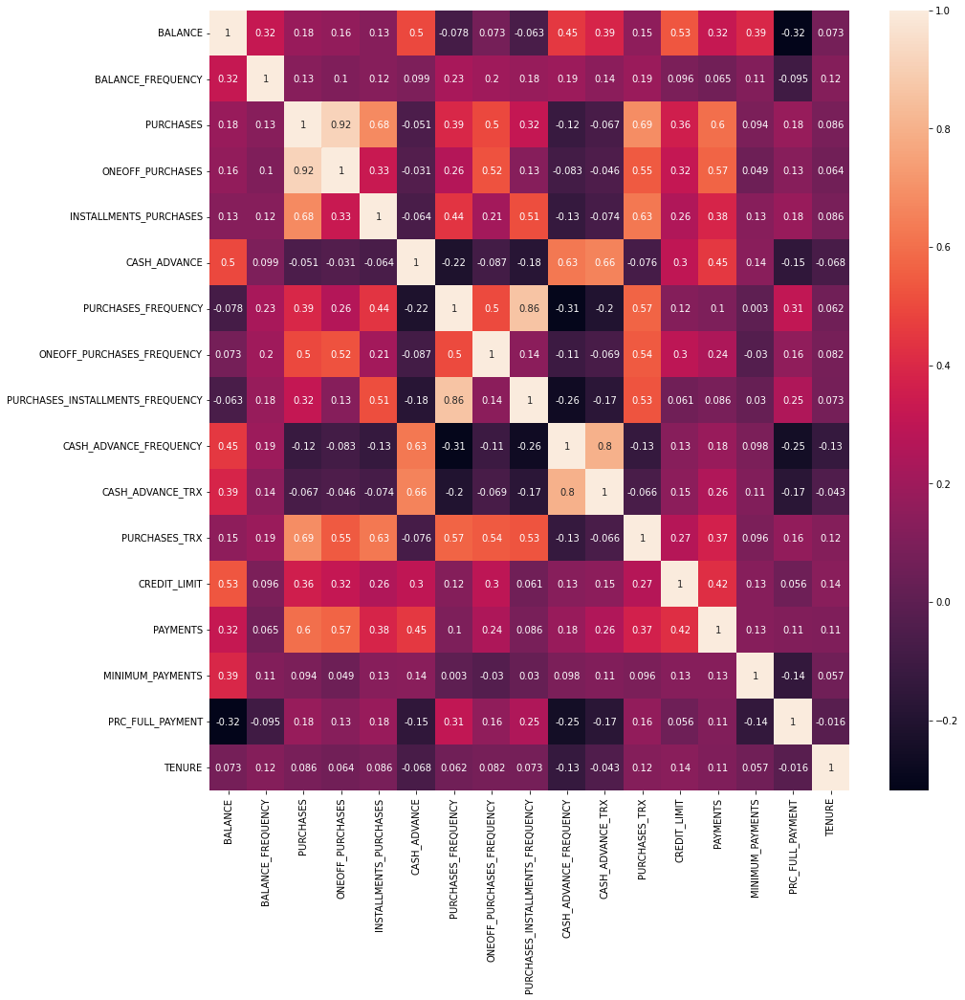
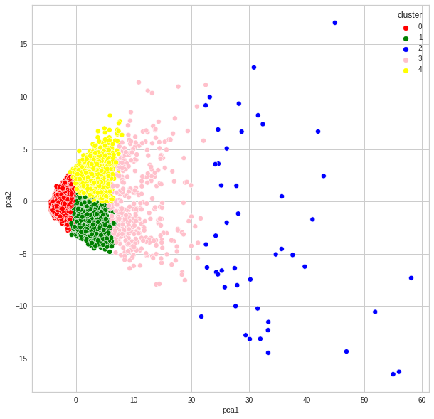

Using credit info of about 9000 customers, we attempt to cluster customers for targeted recommendations or advertisement. The dataset is obtained from [kaggle](https://www.kaggle.com/arjunbhasin2013/ccdata). K-Means clustering is employed. PCA and Autoencoders are also used for dimensionality reduction. This is an unsupervised learning problem. The features are explained in detail inside the notebook.

## KEY TAKEAWAYS

* Data visualization already indicates a couple of features ('PURCHASE_FREQUENCY' and 'TENURE') that could be used for segmentation. However, for a deeper analysis, we use K-means clustering.

* The optimal no. of clusters is found to be 7 for the original dataset without any dimensionality reduction. The elbow method is used for determining this.

* On examining the clusters, we find some key features that help segment the customers further. The key features are 'BALANCE', 'CASH ADVANCE', 'CREDIT LIMIT' and '% FULL PAYMENTS'. 

* PCA is used to visualize the clusters with clear decision boundaries on a reduced 2-dimensional plane.

* Autoencoder is used for dimensionality reduction of the original dataset and K-Means employed on the encoded dataset. This leads us to a reduced no. of optimal clusters. PCA is used for visualizing this on a 2-dimensional plane.

### Features and their correlation

### Clusters using PCA

